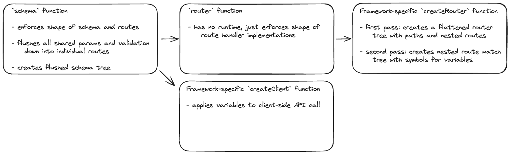

# Rest Well

## Architecture

### `schema` function

- The `schema` function is used to define the schema of the API. This enforces the shape of the schema, but also has a runtime that flushes the validation and types down into the individual routes (API endpoints). For example, if there is a shared path parameter, the validation for it will be combined with any in the child routes.

## Known issues

1. Using `z.literal()` somehow breaks the type system, this needs to be investigated. Specifically, it breaks the recursive default options on the client.
